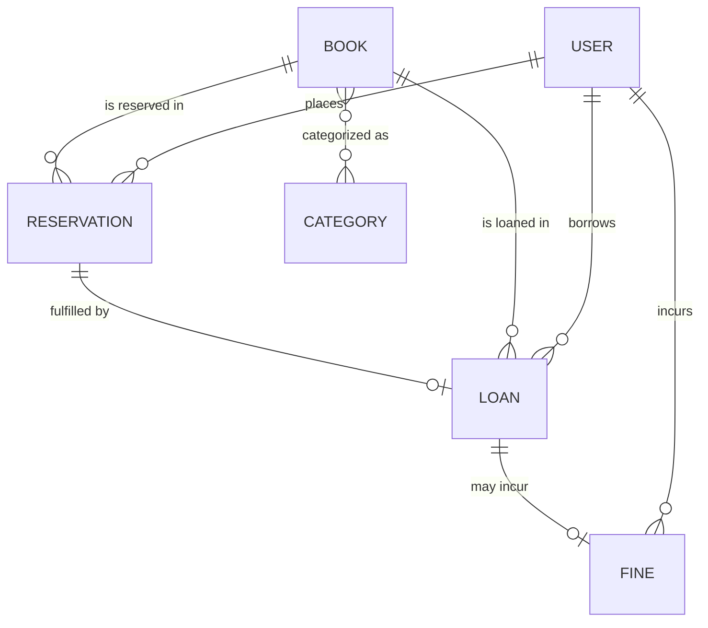

# 📚 Library Management System

A full-stack library management application built for the **Web Applications (Microservices track)**
course. Students browse and reserve books; librarians check books out and process returns;
administrators manage users, the catalog, and fines — all with role-based access control.

> **Stack:** Spring Boot 3.2 REST API (JWT) + React (Vite) SPA, in a single **monorepo** with a
> `main` + `dev` branch strategy and one pull request per feature.

<!-- After deploying (see "Deployment"), put the public URL here -->
**Live demo:** _add your Render/Railway URL here_

---

## Features

- **Auth & roles** — registration, JWT login, three roles (STUDENT, LIBRARIAN, ADMIN) with endpoint- and method-level authorization.
- **Catalog** — books & categories (many-to-many), filterable search with pagination and sorting.
- **Reservations** — students reserve/cancel; 48h auto-expiry via a scheduled job.
- **Loans** — librarian/admin checkout, due dates, transactional returns, active/overdue lists.
- **Fines** — automatic overdue fines, pay (staff) / waive (admin), borrowing blocked above a threshold.
- **Cross-cutting** — Bean Validation (client + server), global error handling, SLF4J/Logback with a dedicated error log.

## Tech stack

| Layer | Technologies |
|-------|--------------|
| Backend | Java 21, Spring Boot 3.2, Spring Data JPA, Spring Security (JWT), Bean Validation, springdoc/OpenAPI |
| Database | PostgreSQL (dev) · H2 in-memory (test) |
| Frontend | React 18, Vite, React Router, Axios |
| Tooling | Maven, JUnit 5, Mockito, JaCoCo, Docker / Docker Compose |

## Repository layout

```
library-management-app/
├── backend/          # Spring Boot REST API   (see backend/README.md for details + ER diagram)
├── frontend/         # React + Vite SPA
├── docs/RUNBOOK.md   # team PR / review / merge workflow
└── docker-compose.yml
```

## Architecture

```
React SPA  ──HTTP/JSON + JWT──>  Spring Boot REST API  ──JPA──>  PostgreSQL
(/frontend)                       (/backend, layered:            (H2 in tests)
                                   controller→service→repository)
```

The frontend is fully decoupled and talks to the API over REST with a Bearer token. In Docker, nginx
serves the SPA and reverse-proxies `/api` to the backend.

## Data model (ER diagram)

Six interconnected entities covering `@OneToOne`, `@OneToMany`/`@ManyToOne`, and `@ManyToMany`.



Full attribute-level diagram and relationship notes: [`backend/README.md`](backend/README.md).

## Screenshots

_Run the app and drop screenshots into `docs/screenshots/`, then embed them here, e.g.:_

```


```

## Getting started

### Option A — Docker Compose (everything at once)

```bash
docker compose up --build
```
- Frontend → http://localhost:3000
- Backend API → http://localhost:8080/api  (Swagger UI: http://localhost:8080/api/swagger-ui.html)
- PostgreSQL → localhost:5432 (`library` / `library`)

### Option B — run each part manually

**Backend** (needs a local PostgreSQL, or override `SPRING_DATASOURCE_*`):
```bash
cd backend
./mvnw spring-boot:run     # dev profile (PostgreSQL)
./mvnw test                # tests run on in-memory H2
```

**Frontend:**
```bash
cd frontend
cp .env.example .env       # defaults to http://localhost:8080/api
npm install && npm run dev # http://localhost:5173
```

## API documentation

Interactive OpenAPI/Swagger UI at `http://localhost:8080/api/swagger-ui.html` when the backend runs.
Endpoint summary is in [`backend/README.md`](backend/README.md).

## Testing

- **158 automated tests** (JUnit 5 + Mockito): service unit tests, `@WebMvcTest` controller slices, and end-to-end `@SpringBootTest` + MockMvc tests on H2.
- **Service-layer coverage ≈ 75%** (JaCoCo) — report at `backend/target/site/jacoco/index.html` after `./mvnw verify`.

## Branch strategy & contributions

`main` (release) ← `dev` (integration) ← one feature branch per slice, merged via reviewed pull requests.
The full PR / review / merge workflow is in [`docs/RUNBOOK.md`](docs/RUNBOOK.md).

| Member | GitHub | Contributions |
|--------|--------|---------------|
| Răzvan Cutuliga | [@crazvan6](https://github.com/crazvan6) | Backend foundation (domain, persistence, config) · Frontend shell & auth · Deployment & docs |
| Bogdan Manolache | [@bogdiz](https://github.com/bogdiz) | Backend security & catalog · Frontend catalog UI |
| Ștefan Georgian | [@Georgian2003](https://github.com/Georgian2003) | Backend lending, scheduling & tests · Frontend lending UI & dashboards |

## Deployment

The app deploys as three containers (`db`, `backend`, `frontend`) via `docker-compose.yml`.
For a public URL on a free tier:

- **Render / Railway:** create a PostgreSQL instance, deploy `backend/` (set `SPRING_DATASOURCE_*` and `JWT_SECRET` env vars) and `frontend/` (set build arg `VITE_API_URL` to the backend's public URL + `/api`), then put the frontend URL in **Live demo** above.
- **Any container host / VPS:** `docker compose up -d --build`.

## Requirements coverage (mandatory)

| Requirement | Status |
|-------------|--------|
| Data model (6+ entities, all relation types, ER) | ✅ |
| CRUD + service layer + exception handling | ✅ |
| Multi-environment (dev PostgreSQL / test H2) | ✅ |
| Testing (unit + ≥3 e2e, ≥70% service coverage) | ✅ (~75%) |
| Views + validation (client + server) | ✅ |
| Logging (SLF4J/Logback + error file) | ✅ |
| Pagination + sorting (3 entities) | ✅ |
| Spring Security (JWT, roles, 401/403) | ✅ |

---

_University project — Web Applications with Microservices Architecture._
