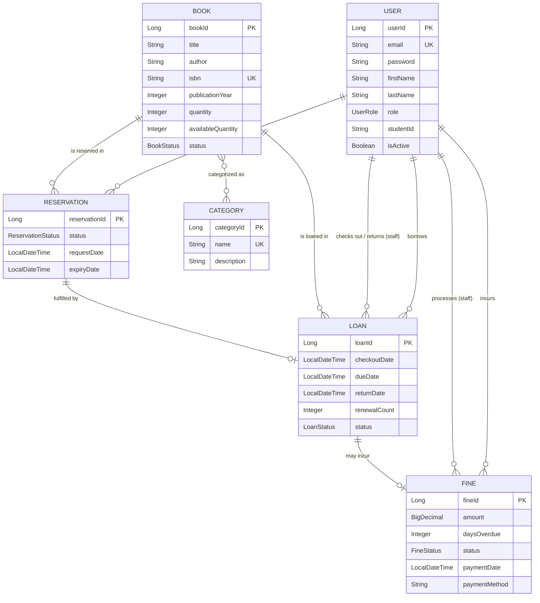

# Library Management — Backend (Spring Boot REST API)

Java 21 · Spring Boot 3.2 · Spring Data JPA · Spring Security (JWT) · PostgreSQL/H2 · springdoc OpenAPI.

This module is a stateless REST API. Authentication is JWT-based; the React SPA in `../frontend`
consumes it. Interactive API docs: `http://localhost:8080/api/swagger-ui.html`.

## Architecture

Classic layered architecture:

```
controller  ──>  service (interface) ──> service.impl ──> repository (Spring Data JPA) ──> entity
     │                                        │
     └── DTO request/response (+ mapper)      └── domain rules on entities
```

Cross-cutting: `security` (JWT filter, token provider, BCrypt), `config` (JPA auditing, OpenAPI,
scheduling, properties), `exception` + `exception/handler` (global `@RestControllerAdvice`),
`validator` (Bean Validation + custom `@ValidPassword`).

## Data model (ER diagram)

6 interconnected entities covering all relationship types: `@OneToOne`, `@OneToMany`/`@ManyToOne`,
and `@ManyToMany`.



**Relationship summary**
- `Book` ↔ `Category`: **@ManyToMany** (join table `book_categories`).
- `User` → `Loan` / `Reservation` / `Fine`: **@OneToMany / @ManyToOne** (a user owns many; staff are also referenced as `checkedOutBy` / `returnedBy` / `processedBy`).
- `Book` → `Loan` / `Reservation`: **@OneToMany / @ManyToOne**.
- `Reservation` ↔ `Loan`: **@OneToOne** (a reservation is fulfilled by at most one loan).
- `Loan` ↔ `Fine`: **@OneToOne** (an overdue loan incurs at most one fine).

## Multi-environment configuration

| Profile | Database | `ddl-auto` | Activated by |
|---------|----------|-----------|--------------|
| `dev` (default) | PostgreSQL | `update` | `SPRING_PROFILES_ACTIVE=dev` (default) |
| `test` | H2 in-memory | `create-drop` | `@ActiveProfiles("test")` in tests |

Config files: `application.yml` (common), `application-dev.yml`, `application-test.yml`.
DB credentials and the JWT secret are externalized via env vars (`SPRING_DATASOURCE_*`, `JWT_SECRET`).

## Build & run

```bash
./mvnw spring-boot:run        # dev profile (needs a PostgreSQL on localhost:5432/library_db)
./mvnw test                   # runs against in-memory H2 (test profile)
./mvnw clean verify           # full build + tests + JaCoCo report -> target/site/jacoco/index.html
```

## Testing

- **JUnit 5 + Mockito** unit tests for the service layer (**~75% instruction coverage**, requirement: ≥70%).
- **`@WebMvcTest`** controller slice tests.
- **End-to-end integration tests** (`@SpringBootTest` + MockMvc + H2): auth round-trip, validation
  errors, RBAC (403), catalog creation + paginated search, paginated lending endpoints.
- **158 tests**, all green. Coverage report: `target/site/jacoco/index.html`.

## Security & roles

Stateless JWT (HS512), BCrypt password hashing. Three roles — **STUDENT**, **LIBRARIAN**, **ADMIN** —
enforced via HTTP rules and `@PreAuthorize` method security. Role denials return `403`,
unauthenticated requests `401`.

## API overview

All paths are prefixed with the context path `/api`.

| Domain | Key endpoints |
|--------|---------------|
| Auth | `POST /v1/auth/register`, `POST /v1/auth/login`, `GET /v1/auth/validate` |
| Users | `GET /v1/users/profile`, admin user/librarian management |
| Catalog | `GET/POST/PUT/DELETE /v1/books`, `GET /v1/books/search` (paged), `…/v1/categories` |
| Reservations | `POST /v1/reservations`, `GET /v1/reservations/my-reservations`, cancel |
| Loans | `POST /v1/loans/checkout`, `POST /v1/loans/return`, `GET /v1/loans` (paged), `…/active`, `…/overdue` |
| Fines | `GET /v1/fines` (paged), `…/pending`, `POST /v1/fines/pay`, `POST /v1/fines/waive` |

**Pagination & sorting** (`GET /v1/books/search`, `GET /v1/loans`, `GET /v1/fines`) accept
`page`, `size`, and `sort=field,(asc|desc)` and return a `PageResponse` envelope
(`content`, `totalElements`, `totalPages`, `currentPage`, `pageSize`, `hasNext`, `hasPrevious`).

## Scheduled jobs

`ScheduledTasksService` runs reservation expiry (48h), overdue-loan status updates, and daily fine
recalculation (configurable cron via `library.scheduling.*`).
